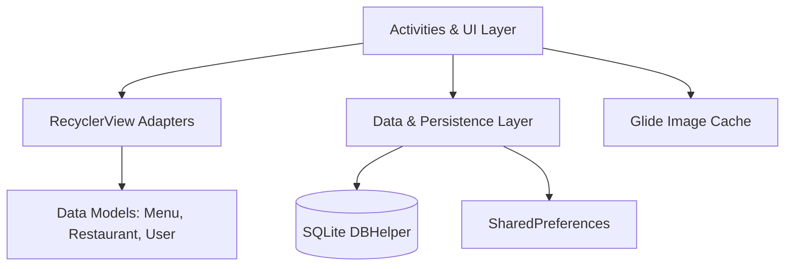

# 🐾 WhiskerBites - Android Pet Food & Treats Ordering App

<div align="center">

[-3DDC84?style=for-the-badge&logo=android&logoColor=white)](https://developer.android.com/)
[](https://www.java.com/)
[](https://gradle.org/)
[](https://material.io/)
[](https://opensource.org/licenses/MIT)

<br/>

**WhiskerBites** is a native Android application designed to deliver an intuitive, responsive, and seamless food and treats ordering experience for pet owners. Browse dedicated pet nutrition stores, customize orders, and checkout with local persistence.

</div>

---

## 📱 App Highlights & User Interface

<div align="center">
  <table>
    <tr>
      <th width="50%" align="center">🔐 User Authentication & Profile</th>
      <th width="50%" align="center">🛍️ Store Catalog & Menu Selection</th>
    </tr>
    <tr>
      <td align="center"></td>
      <td align="center"></td>
    </tr>
    <tr>
      <th width="50%" align="center">🛒 Interactive Cart & Item Management</th>
      <th width="50%" align="center">🎉 Order Placement & Success</th>
    </tr>
    <tr>
      <td align="center"></td>
      <td align="center"></td>
    </tr>
  </table>
</div>

---

## ✨ Key Features

- **🔐 User Authentication & Session Management**:
  - Secure registration and login workflows backed by local SQLite database validation.
  - Persistent user sessions using Android `SharedPreferences`.

- **🏪 Store & Restaurant Catalog**:
  - Browse available pet food suppliers, complete with operating hours, ratings, and location details.
  - Fast-loading imagery powered by `Glide`.

- **🍖 Interactive Menu & Custom Cart**:
  - Browse food categories, diet types, and portion sizes.
  - Real-time cart calculations (subtotal, delivery fees, and taxes).
  - Dynamic quantity increment/decrement controls.

- **📦 Order Confirmation & History**:
  - Clean order summary and delivery details confirmation.
  - Success animations and order status feedback.

- **💾 Local SQLite Database Persistence**:
  - Efficient local database (`DBHelper`) handling user credentials and offline-accessible states.

---

## 🛠️ Architecture & Tech Stack



* **Language**: Java 8+
* **Platform**: Native Android SDK (Min SDK: 24, Target SDK: 34)
* **UI Components**: AndroidX, Material Design 2, ConstraintLayout, CardView, RecyclerView
* **Third-Party Libraries**:
  * [Glide 4.11.0](https://github.com/bumptech/glide) — Efficient asynchronous image loading and caching
  * [Gson 2.8.6](https://github.com/google/gson) — JSON serialization/deserialization
  * [CircleImageView 3.1.0](https://github.com/hdodenhof/CircleImageView) — Circular profile and avatar renderings

---

## 📂 Project Structure

```text
app/src/main/
├── AndroidManifest.xml
├── java/com/android/foodorderapp/
│   ├── MainActivity.java             # Main store catalog activity
│   ├── RestaurantMenuActivity.java   # Food item listings and menu selection
│   ├── PlaceYourOrderActivity.java   # Cart management and order placement
│   ├── OrderSucceessActivity.java    # Order confirmation screen
│   ├── LoginActivity.java            # User login authentication
│   ├── RegisterActivity.java         # New account registration
│   ├── AccountActivity.java          # User profile view
│   ├── SplashActivity.java           # Animated splash entry
│   ├── DBHelper.java                 # SQLite database helper
│   ├── SharedPreferencesHelper.java  # Session cache helper
│   ├── adapters/                     # RecyclerView adapters
│   └── model/                        # POJO models (Menu, Restaurant, Hours)
└── res/                              # Layout XMLs, drawables, and values
```

---

## 🚀 Getting Started

### Prerequisites
* **Android Studio**: Android Studio Giraffe / Hedgehog / Iguana or later
* **JDK**: OpenJDK 17 or Java 11+
* **Android SDK**: API Level 34 installed

### Installation & Run

1. **Clone the repository:**
   ```bash
   git clone https://github.com/dev-muneebali/WhiskerBites.git
   cd WhiskerBites
   ```

2. **Open in Android Studio:**
   * Select **File > Open...** and choose the `WhiskerBites` directory.
   * Allow Gradle to sync dependencies automatically.

3. **Run on Device / Emulator:**
   * Choose an Android Virtual Device (AVD) running API 24 or higher.
   * Click **Run (Shift + F10)** or `./gradlew installDebug`.

---

## 👤 Author

**Muneeb Ali**
* GitHub: [@dev-muneebali](https://github.com/dev-muneebali)
* Email: Available on profile

---

## 📄 License
This project is open-source and available under the [MIT License](LICENSE).
